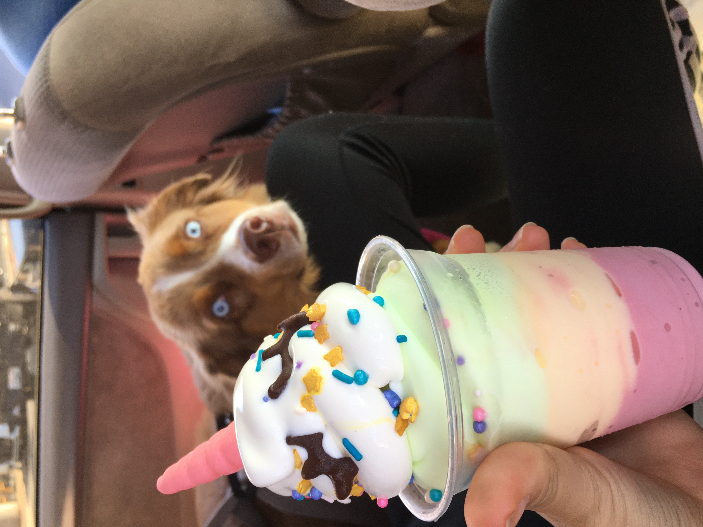
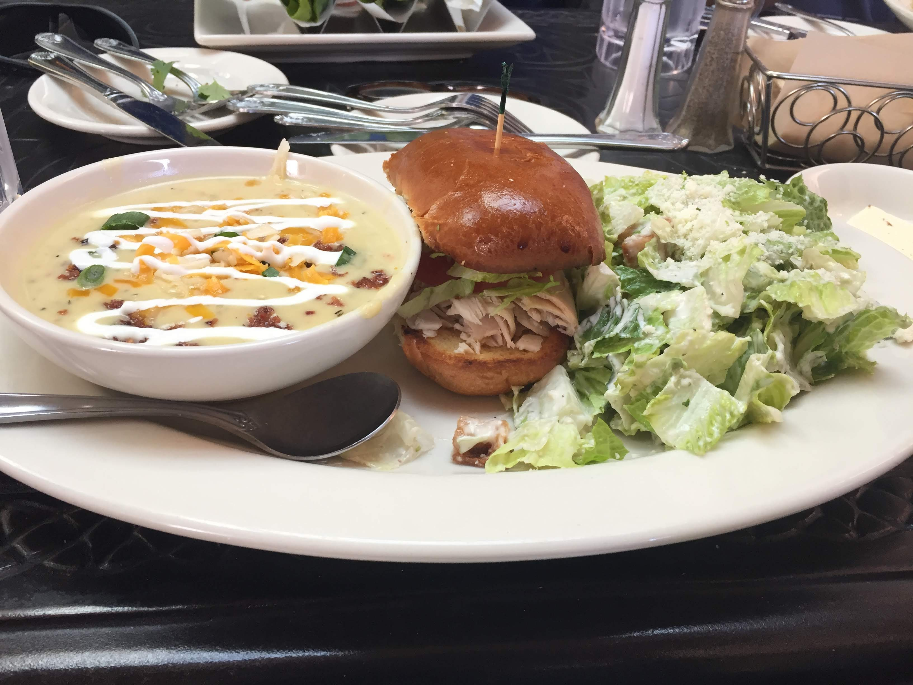

## Random Food Reviews 

Welcome!!
Here are some random pictures of food that I have tried during my life!! I will be reviewing (HONESTLY) fours aspects of each food: 

The **FLAVOR**, the **APPEARANCE**, **QUALITY** of product, and the **STORE/RESTURANT** I bought it from. 

### Food 1: Unicorn Dole Whip

This is a creation called the Unicorn Dole Whip. It contains three flavors of dole whipe, which is like sorbet, those three flavors being lime, pineapple, and strawberry. Then to top it all off, there is vanilla soft serve with sprinkles and a chocolate horn. The flavor of it overall was amazing. However, if I had to choose something it would be the amount of each flavor. The lime dole whip is at the top, which overpowered the other flavors, so I would either put less lime or reorder the flavors with lime at the bottom. As you can tell from my picture, featuring my dog lol, this dessert was definietly picture worthy!! The colors all look amazing and it is just a very cute dessert to enjoy. The quality of this product was amazing, the price of this dessert was about $7. In my opinion, that is a very fair amount to pay for it. The dessert was fairly large, big enough to share, and worthy the money! For all the foodies wondering I bought this dessert from [Hula Girls Shaved Ice](https://my-site-100228-102576.square.site/), and although this specific dessert is seasonal they have an AMAZING assorment of different kinds of desserts. Ranging from shaved ice to dole whip floats!! They are located in Huntington Beach, CA and a great way to end a day at the beach! Overall a 9/10 :) 

### Food 2: Renee's Special 

This plate of food is called the Renee's Special! It's from the [Cheesecake Factory](https://www.thecheesecakefactory.com/menu/lunch-specials/renees-lunch-special/) and I am not positive but I believe the price of it was around $10-15. The meal contains a bowl of soup, half of a sandwhich, and a side salad. I personally think that the sandwhich, I got turkey, was pretty good but it tasted like an average turkey sandwich. I am not the biggest fan of salads, but the side ceasar salad was also pretty good. The best part by FAR was the soup. It was an amazing potato soup!! It was a creamy soup with cheese, bacon bits, green onions, and peices of potato! This might be my favorite soup of all time, however because they give you the soup of the day with the Renee's Special I would only get this meal again if the potato soup was the soup of the day. There is nothing special about the presentation of this meal, but it is very easy to eat and enjoy. I personally think that this meal is worth the price because it is a lot of food, and I always have leftovers!! Overall an 8/10 :o

